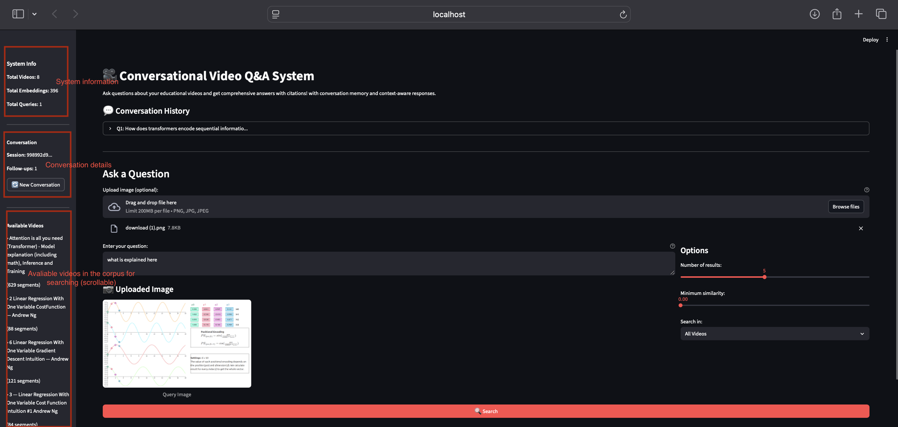
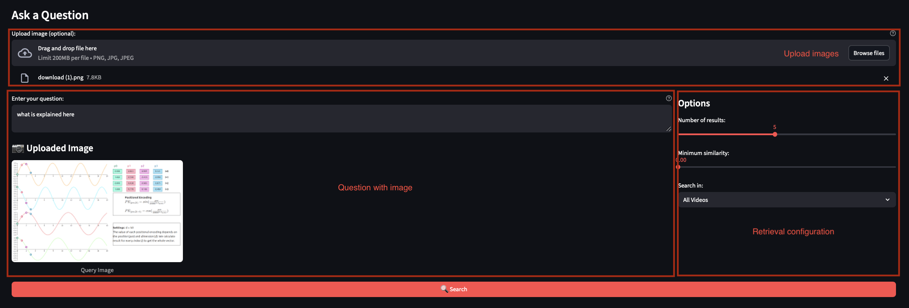
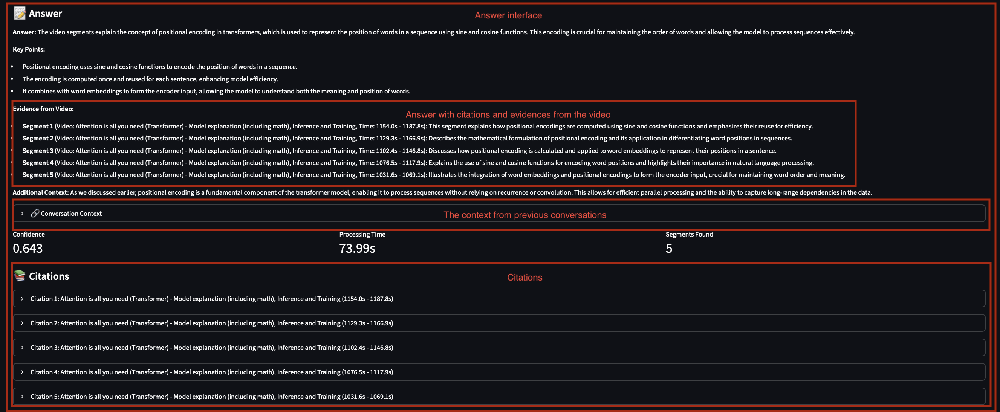
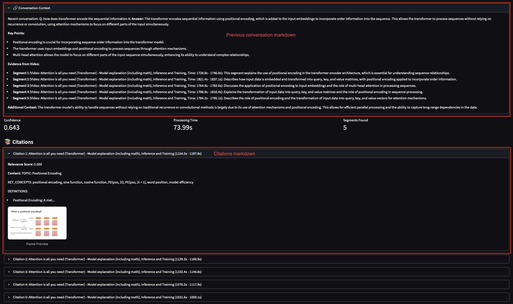
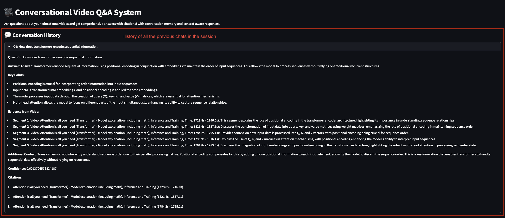

# multimodal-video-qa
🎥 Ask questions about video content and get intelligent, cited answers. Built with multimodal AI, conversational memory, and vector databases.

## Quick Start

### 1. Installation

```bash
# Clone the repository
git clone <repository-url>
cd multimodal-video-qa

# Install dependencies
pip install -r requirements.txt
```

### 2. Set Up Environment

```bash
# Required environment variable
export OPENAI_API_KEY="your-api-key-here"
```

### 3. Download Videos

```bash
# Download a single video
python youtube_downloader.py "https://www.youtube.com/watch?v=VIDEO_ID"

# Download a playlist
python youtube_downloader.py "https://www.youtube.com/playlist?list=PLAYLIST_ID"

# Download with specific quality
python youtube_downloader.py "https://www.youtube.com/watch?v=VIDEO_ID" -q 720p
```

### 4. Process Videos

Edit `pipeline_config.yaml` to configure processing options, then run:

```bash
# Run the complete pipeline
python pipeline_processor.py --config pipeline_config.yaml
```

### 5. Ask Questions

**Web Interface**

```bash
streamlit run streamlit_app_conversational.py
```

Then open your browser to `http://localhost:8501`

## The streamlit UI

### Interface showing the system and conversation info with the list of available videos for searching


### Interface to ask question and configure the retrieval parameters


### Interface showing the answer and the citations with explainable evidence


### Interface showing the expanded view of the citations and the current conversational context


### Interface showing the all the previous conversations for the current session


Support
For issues and questions, please open an issue on GitHub.